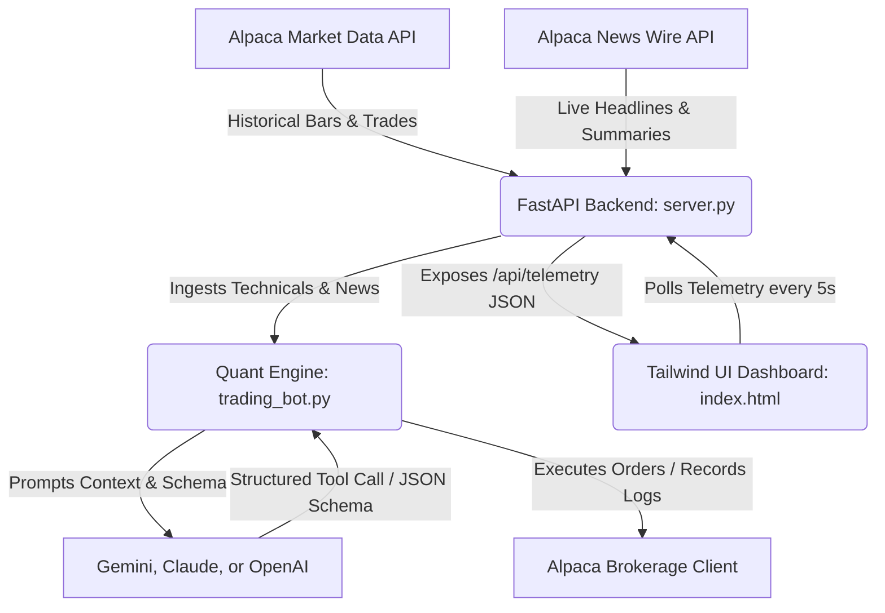

# stock-trading-bot

An autonomous, production-grade hybrid AI hedge fund engine utilizing momentum indicators, volume distribution, macro news wire catalysts, and dynamic conviction scaling. Built to automate multi-asset allocation decisions with built-in risk governance and a sleek real-time monitoring interface.

---

## 1. Project Overview

Stock Trading Bot is designed as an autonomous execution pipeline that bridges quantitative technical analysis and LLM-driven macro reasoning. 
The system operates on a dual-engine architecture:
*   **Deterministic Risk Engine:** A pure Python controller executing real-time portfolio balance sheet audits, asymmetric volatility-based stops/limits, and recent liquidation cooldown periods.
*   **AI Discretionary CIO Engine (Multi-LLM):** A Generative AI agent (powered by Gemini, Claude, or OpenAI) that analyzes broad market regimes, asset technical indicator stacks, and incoming news wire flows to issue conviction-weighted BUY, SELL, or HOLD portfolio reallocations.

---

## 2. Architecture & Data Flow



1.  **FastAPI Backend (`server.py`)** acts as the telemetry aggregator. It gathers current market prices and calculates a comprehensive quantitative indicator stack for all assets in the active watchlist.
2.  **Quant Core Engine (`trading_bot.py`)** parses recent market news wire articles via Alpaca's news client, calculates technical overlays (RSI, SMA-50 distance, realized volatility, ADX, MACD, Volume Ratios), and sends this structured context to the active LLM.
3.  **The Web Dashboard (`index.html`)** polls the FastAPI backend `/api/telemetry` endpoint every 5 seconds to visualize the health of the system, asset indicators, and current streaming news events.

---

## 3. Repository Blueprint

```
stock-trading-bot/
├── server.py             # Optimized FastAPI aggregator exposing the dashboard API
├── trading_bot.py        # Core quantitative engine managing AI logic & order execution
├── index.html            # High-fidelity dashboard terminal using Tailwind CSS & Vanilla JS
├── .env.example          # Environment keys template (Gemini & Alpaca credentials)
└── requirements.txt      # Pinned external dependencies (FastAPI, Alpaca-Py, Anthropic, etc.)
```

---

## 4. Multi-LLM Provider & Model Setup

The system includes a provider-agnostic adapter layer allowing you to switch between Google Gemini, Anthropic Claude, and OpenAI GPT models seamlessly.

### Configuration Parameters
Open your local `.env` file and configure these parameters:
*   `LLM_PROVIDER`: The active model chatbot client. Set to `gemini`, `anthropic`, or `openai`.
*   `LLM_MODEL`: Select one of the verified, schema-tested models:
    *   **Gemini Models:** `gemini-3.5-flash` (tested/default), `gemini-3.1-pro`
    *   **Claude Models:** `claude-4.7-sonnet`, `claude-4.8-opus` (configured for forced tool-calling integration)
    *   **OpenAI Models:** `gpt-5.5` (configured for structured output parsing)

---

## 5. Onboarding External Services Setup Guides

### A. Alpaca Markets Setup
1.  **Create an Account:** Visit [Alpaca Markets](https://alpaca.markets/) and sign up.
2.  **Access Paper Trading:** In the Alpaca dashboard sidebar, switch your account mode from **Live** to **Paper** to test with mock money.
3.  **Retrieve API Credentials:**
    *   On your Paper Trading dashboard, find the section labeled **API Keys**.
    *   Click **Generate Key** or **View**.
    *   Copy the **API Key ID** and **Secret Key**.
    *   Map these parameters to `ALPACA_KEY_ID` and `ALPACA_SECRET` in your `.env` file.
4.  **Endpoint URLs:**
    *   The bot uses `paper=True` in its config, routing trade execution commands directly to the paper API endpoint: `https://paper-api.alpaca.markets`.

### B. Chatbot Key Provisioning
*   **Google Gemini (Google AI Studio):**
    1.  Log into [Google AI Studio](https://aistudio.google.com/).
    2.  Click **Get API Key** at the top left.
    3.  Select **Create API Key**, choosing either a new or existing Google Cloud project.
    4.  Copy the generated key and assign it to `GEMINI_API_KEY` in your `.env` file.
*   **Anthropic Claude (Anthropic Console):**
    1.  Log into the [Anthropic Console](https://console.anthropic.com/).
    2.  Navigate to **API Keys** under the account settings panel.
    3.  Click **Create Key**, give it a name, and generate the token.
    4.  Copy the key (starts with `sk-ant-`) and assign it to `ANTHROPIC_API_KEY` in your `.env` file.
*   **OpenAI GPT (OpenAI Platform):**
    1.  Log into the [OpenAI Platform](https://platform.openai.com/).
    2.  Navigate to **API Keys** under the dashboard settings.
    3.  Click **Create new secret key**, name it, and copy it.
    4.  Assign the key to `OPENAI_API_KEY` in your `.env` file.

### C. Discord Webhook Integration (Optional)
To receive real-time execution briefings, order logs, and risk threshold alerts directly in your Discord server:
1. Open your Discord server and navigate to your target channel settings.
2. Select the **Integrations** tab and click on **Webhooks**.
3. Create a new webhook, copy the generated Webhook URL, and map it to `DISCORD_WEBHOOK_URL` in your `.env` file.

---

## 6. Quickstart Installation Guide

### Step 1: Create a Virtual Environment
Navigate to the project root directory and create a virtual environment:
```bash
# Navigate to the repository folder
cd stock-trading-bot

# Create a virtual environment
python3 -m venv venv

# Activate the virtual environment
source venv/bin/activate
```

### Step 2: Install Pinned Dependencies
Install the required packages using pip:
```bash
pip install -r requirements.txt
```

### Step 3: Configure Environment Variables
Copy the configuration template to `.env` and fill in your actual credentials:
```bash
cp .env.example .env
```

---

## 7. Execution Manual

### Running the Backend Server
Start the FastAPI server using Uvicorn. The server runs on local port `8000` with hot-reloading enabled by default:
```bash
python server.py
```
Uvicorn will bind to `http://127.0.0.1:8000`. You can inspect the live JSON telemetry feed at `http://127.0.0.1:8000/api/telemetry`.

### Running the Live Trading Bot Loop
To launch the autonomous trading bot loop directly, execute the script:
```bash
python trading_bot.py
```

### Serving the Frontend Terminal Dashboard
Simply open the `index.html` file in any modern web browser. Since it utilizes Tailwind CSS via CDN and does not require complex building steps, you can open it directly from the file system:
*   **macOS:** `open index.html`
*   **Linux:** `xdg-open index.html`
*   **Windows:** `start index.html`


